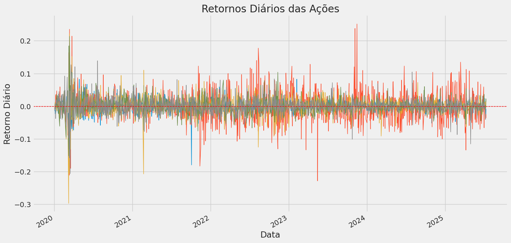
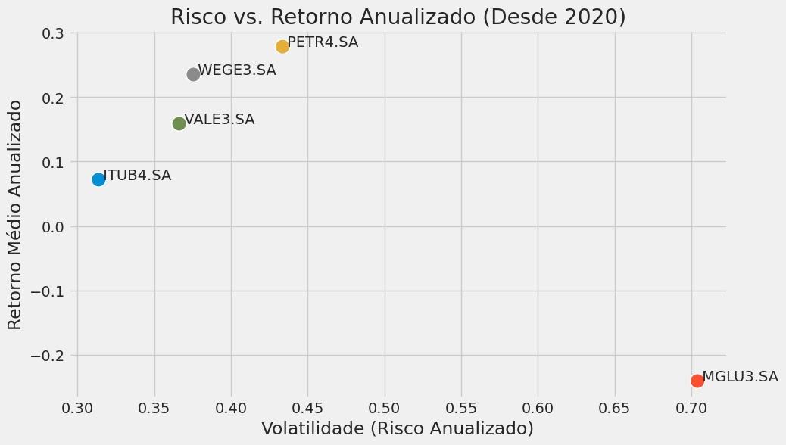
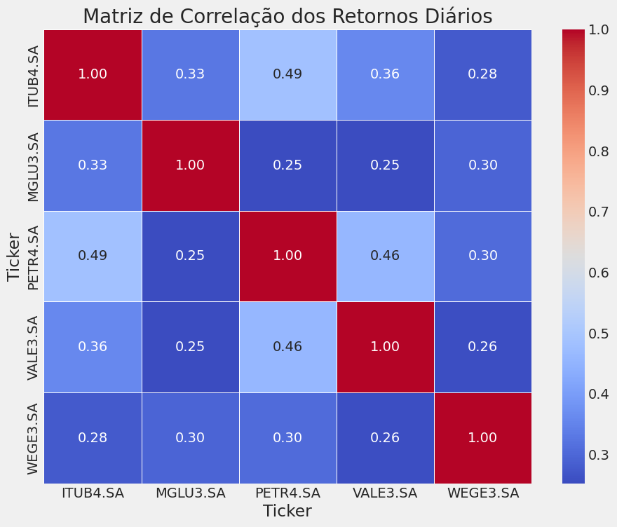

# Análise de Risco e Retorno de Ações Brasileiras

**Autor:** Caio Fernandes Nogueira
**Data:** 18 de julho de 2025
**Projeto:** Análise de ações brasileiras

## 🎯 Objetivo
Este projeto realiza uma análise comparativa de um portfólio de cinco grandes empresas brasileiras listadas na B3 (PETR4, VALE3, ITUB4, MGLU3, WEGE3) no período de 1º de janeiro de 2020 até a data atual. O foco é extrair insights sobre risco, retorno e correlação, utilizando Python e suas principais bibliotecas de análise de dados.

## 🛠️ Ferramentas Utilizadas
* Python
* Pandas (para manipulação e análise de dados)
* yfinance (para aquisição de dados históricos do Yahoo Finance)
* Matplotlib & Seaborn (para visualização de dados)
* Google Colab

## 📈 Análise e Resultados

A análise foi dividida em etapas, desde a coleta e limpeza dos dados até a criação de visualizações consolidadas para extrair insights de negócio.

### 1. Trajetória dos Preços Históricos
A primeira etapa da análise é visualizar a evolução dos preços históricos. Isso nos dá uma visão macroscópica do comportamento de cada ação, permitindo identificar tendências de longo prazo e períodos de alta volatilidade, como a queda abrupta no início de 2020.


### 2. Retornos Diários e Volatilidade
Para uma análise financeira robusta, trabalhamos com os retornos diários (variação percentual). O gráfico abaixo nos permite visualizar os "clusters de volatilidade" — períodos em que a incerteza do mercado foi significativamente maior, representados por picos e vales extremos.



### 3. Risco vs. Retorno Anualizado
Este gráfico de dispersão posiciona cada ativo com base em sua volatilidade (risco) e retorno médio anualizado. É a principal visualização para comparar o perfil de cada ação.



**Principais Insights:**
* **MGLU3.SA** foi, de longe, o ativo mais volátil (maior risco), apresentando também um retorno médio negativo no período.
* **PETR4.SA** ofereceu o maior retorno anualizado, acompanhado de uma volatilidade consideravelmente alta.
* **WEGE3.SA** demonstrou um bom equilíbrio entre risco e retorno, com um retorno positivo e risco moderado.
* **ITUB4.SA** caracterizou-se como o ativo de menor risco (menor volatilidade) dentro do portfólio.

### 4. Matriz de Correlação
O heatmap de correlação mostra como os retornos dos ativos se movem em conjunto. É uma ferramenta essencial para entender os benefícios da diversificação.



**Principais Insights:**
* Existe uma correlação positiva moderada entre os ativos de commodities **VALE3.SA** e **PETR4.SA** (0.49), e também entre estes e o ativo do setor bancário **ITUB4.SA**.
* A **WEGE3.SA** apresentou as menores correlações com os demais ativos, destacando-se como uma boa opção para fins de diversificação de portfólio.

## 🚀 Como Executar o Projeto
1.  Clone o repositório: `git clone https://github.com/dolthub/dolt`
2.  Crie um ambiente virtual e instale as dependências a partir do arquivo `requirements.txt`:
    ```bash
    pip install -r requirements.txt
    ```
3.  Execute o notebook `analise_de_acoes.ipynb` em um ambiente Jupyter.
